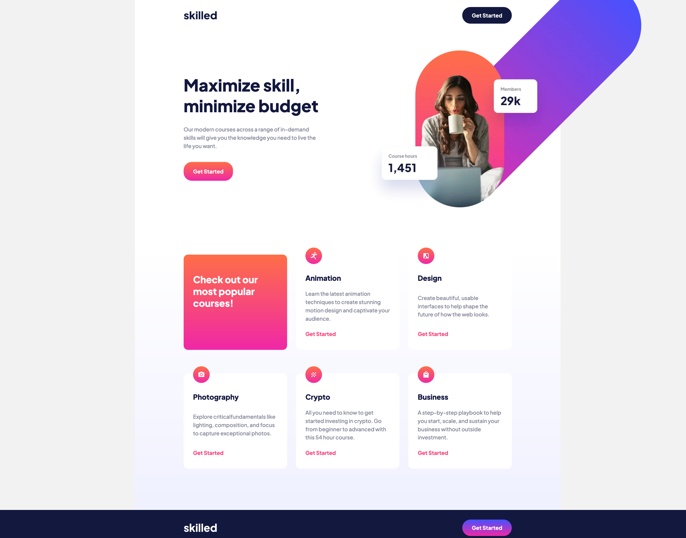

# Frontend Mentor - Skilled e-learning landing page solution

This is a solution to the [Skilled e-learning landing page challenge on Frontend Mentor](https://www.frontendmentor.io/challenges/skilled-elearning-landing-page-S1ObDrZ8q). Frontend Mentor challenges help you improve your coding skills by building realistic projects.

## Table of contents

- [Overview](#overview)
  - [The challenge](#the-challenge)
  - [Screenshot](#screenshot)
  - [Links](#links)
- [My process](#my-process)
  - [Built with](#built-with)
  - [What I learned](#what-i-learned)
- [Author](#author)

## Overview

### The challenge

Users should be able to:

- View the optimal layout depending on their device's screen size
- See hover states for interactive elements

### Screenshot



### Links

- Solution URL: [Github](https://github.com/kwonmoon/skilled-elearning-landing-page)
- Live Site URL: [Netlify](https://luxury-sable-1ff45c.netlify.app)

## My process

### Built with

- Semantic HTML5 markup
- CSS custom properties
- Flexbox
- CSS Grid

### What I learned

Placed image file using absolute position, then changed it to static position for mobile screen.

To see how you can add code snippets, see below:

```css
.hero-image {
   position: absolute;
   bottom: 3.3rem;
   left: 49rem;
}

@media screen and (max-width: 600px) {
    .hero-image {
      position: static;
    }   
}
```

## Author

- Frontend Mentor - [@kwonmoon](https://www.frontendmentor.io/profile/kwonmoon)
